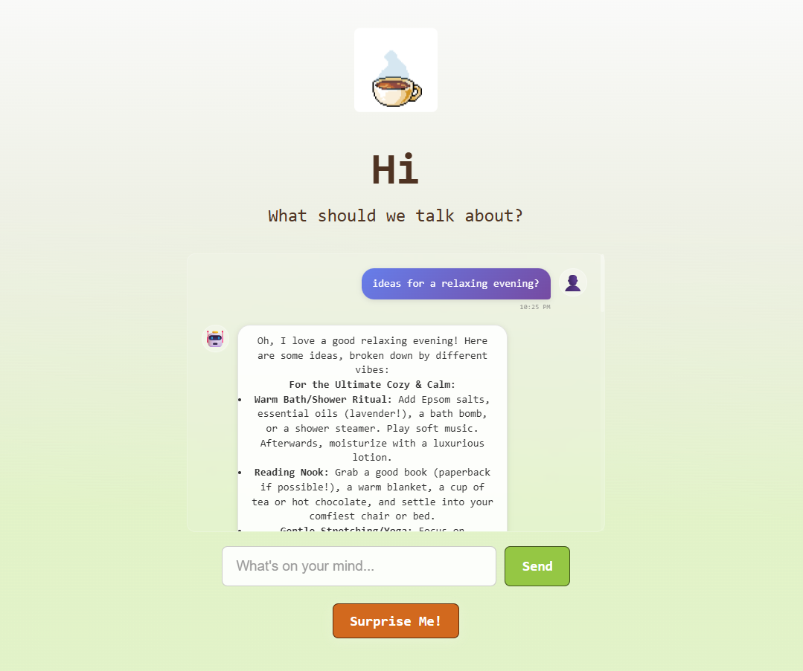

## Cozy AI-Chatbot

A cozy conversational companion powered by Gemini 2.5 Flash.  

---

<p align="center">
  
</p>

### Stack
- Frontend: Vite + React
- Backend: JavaScript
- AI: Gemini 2.5 Flash via API
- Assets: Custom pixel art crafted in Aseprite

---

### How to run
First get your own API key from [here](https://ai.google.dev/gemini-api/docs)
Next, clone this Repository
Then paste it in a .env file into a variable named API_KEY, and run:
```bash
npm install
npm run dev
npm run start:backend
